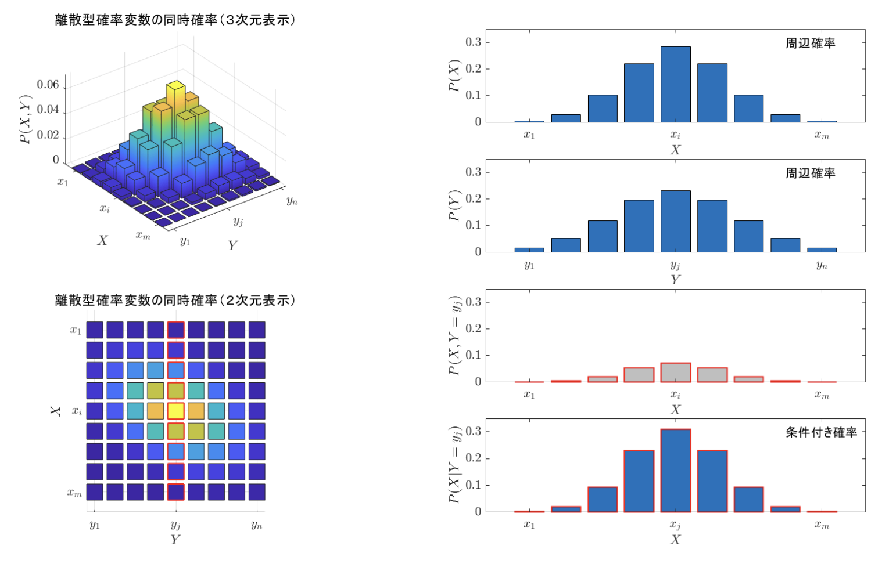
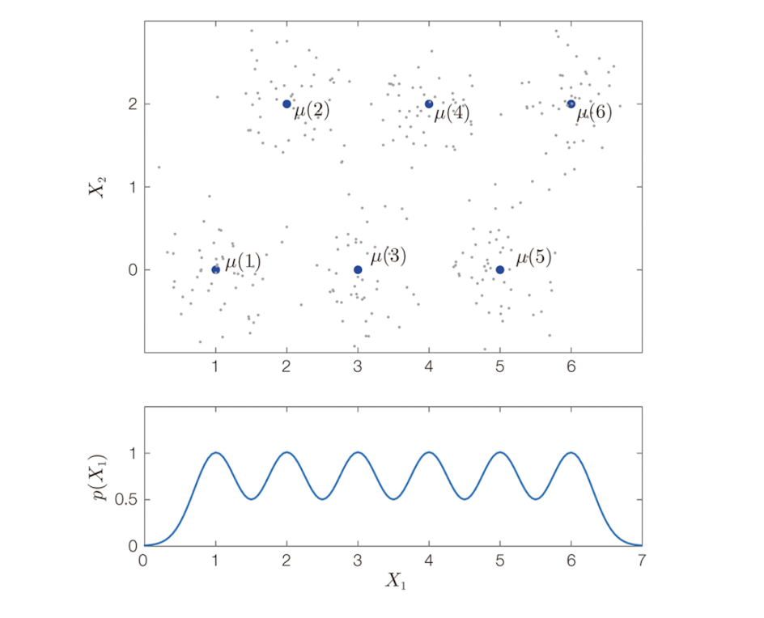
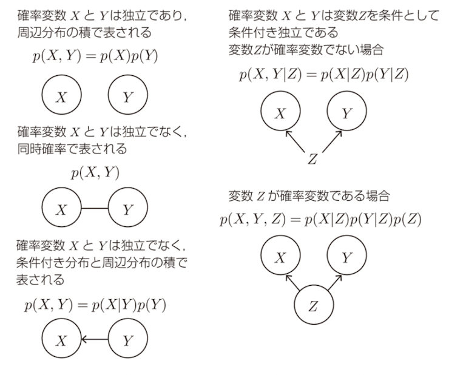
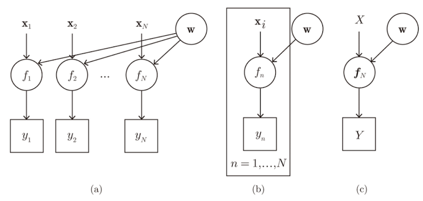
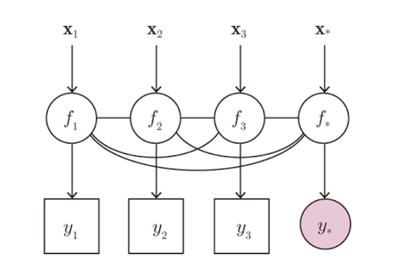

# Chapter 4 確率的生成モデルとガウス過程

「観測 $Y$ は確率分布 $p(Y)$ からのサンプリング $Y \sim p(Y)$ により得られた」とする仮説を、観測 $Y$ の確率的生成モデル（probabilistic generative model）と呼ぶ。本章ではこのモデリングの考え方、定式化、計算方法を扱い、基礎固めを行う。

ガウス過程回帰の基本モデル $y = f(\mathbf{x}) + \epsilon$ では、入力を定数 $\mathbf{x}$ と固定した上で、関数 $f(\cdot)$、観測値 $y$、観測ノイズ $\epsilon$ を確率変数とみなす。ここには直感と逆行する2つの大きな**発想の転換**がある。

* **尤度関数の導入**：「目の前にある観測値 $y$ は確率変数である」という転換（最尤推定法の基礎）。
* **事前確率・事後確率の導入**：「知りたい対象（隠れ変数 $\mathbf{f}$ や未知パラメータ $\theta$）は確率変数である」という転換（ベイズ推定の基礎）。

これらはガウス過程法のみならず機械学習全般の根底をなす重要な考え方である。

---

## 4.1 確率変数と確率的生成モデル

### 4.1.1 確率変数 $X$ と確率分布 $p(X)$

確率変数（random variable）とは、試行ごとに値が確率的に決まる変数である。

* **離散値の場合（例 1：サイコロの出目）**
とり得る値の集合を $\{1, \dots, 6\}$ とすると、各出目の確率の和は 1 となる。

$$\sum_{i=1}^6 p(X = i) = 1$$

* **連続値の場合（例 2：ダーツの刺さった位置）**
実現値 $x \in \mathbb{R}$ の出現確率は確率密度関数 $p(x)$ で表され、特定範囲に入る確率は積分 $p(a < x < b) = \int_a^b p(x) dx$ で定義される。全区間の積分は 1 となる。

$$\int_{-\infty}^\infty p(y) dy = \int p(y) dy = 1$$

1次元ガウス分布の確率密度関数は次式で与えられる。

$$\mathcal{N}(x \vert{} \mu, \sigma^2) = \frac{1}{\sqrt{2\pi\sigma^2}} \exp\left( - \frac{1}{2\sigma^2} (x - \mu)^2 \right)$$

> **定義 4.1（確率過程）**   
> 任意の $N$ 個の入力 $\mathbf{x}_1, \dots, \mathbf{x}_N \in \mathcal{X}$ に対し、$N$ 個の出力 $\mathbf{f}_N = (f(\mathbf{x}_1), \dots, f(\mathbf{x}_N))$ の同時確率 $p(\mathbf{f}_N)$ を与えられる関係 $f(\cdot)$ を **確率過程（stochastic process）** と呼ぶ。

- 「同時確率を与える」の具体例   
入力として好きな地点を 2 つ（$x_1=1, \, x_2=3$）選ぶ。このとき、それぞれの地点での高さ $(f_1, f_2) = (f(1), f(3))$ の組について、「$f_1$ が 1.5 付近、かつ $f_2$ が 3.2 付近になる確率はどれくらい？」という2つの値がペアでどう現れるかを表す数式（確率密度関数 $p(f_1, f_2)$）が 1 つにバシッと定まる、これが「同時確率を与える」ということ。もしこれが $N=3$ 点なら $p(f_1, f_2, f_3)$ が定まり、$N=100$ 点なら 100 変数の同時確率 $p(f_1, \dots, f_{100})$ が定まる。

> **定義 4.2（ガウス過程）**  
> 確率過程 $f(\cdot)$ において、同時確率 $p(f_1, \dots, f_N)$ が $N$ 次元ガウス分布として得られる場合、$f(\cdot)$ を**ガウス過程**と呼ぶ。

「無限次元ベクトル」や「ヒルベルト空間」を持ち出さずとも、「任意の自然数 $N$ に対して同時確率 $p(f_1, \dots, f_N)$ が定まる」と有限の枠組みで言い換えることで、ガウス過程を実用的に扱える。

---

### 4.1.2 同時確率 $p(X, Y)$ と周辺化

複数の確率変数の組 $(X, Y) \in \mathcal{X} \times \mathcal{Y}$ の分布を**同時分布（joint distribution）** $p(X, Y)$ と呼ぶ。

> **定義 4.3（周辺化と周辺分布）**  
> 同時分布 $p(X, Y)$ から不要な変数を積分（または総和）によって消去し、$p(X)$ を得る操作を**周辺化（marginalization）**、得られた分布を **周辺分布（marginal distribution）** と呼ぶ。
> 
> $$p(X) = \int p(X, Y) dY \quad \left( \text{離散値の場合: } p(X) = \sum_{Y \in \mathcal{Y}} p(X, Y) \right)$$
> 
> 

> https://kesco.co.jp/%E7%A2%BA%E7%8E%87%E5%88%86%E5%B8%83/

> **定義 4.4（条件付き分布）**.  
> $X$ を既知・所与としたときの $Y$ の確率分布を**条件付き分布** $p(Y\vert{}X)$ と呼ぶ。
> 
> $$\int p(Y\vert{}X) dY = 1 \tag{4.1}$$
> 
> 
> 
> ※ 条件側 $X$ に関する積分 $\int p(Y\vert{}X) dX$ には制約がない点に注意。

> **定義 4.5（ベイズの定理）**.  
> 乗法定理 $p(X, Y) = p(Y\vert{}X)p(X) = p(X\vert{}Y)p(Y)$ より導かれる：
> 
> $$p(Y\vert{}X) = \frac{p(X\vert{}Y)p(Y)}{p(X)}$$
> 
> 

---
練習のために以下で二例やってみる

#### 連鎖的生成モデルの手順（例 3：サイコロ・ダーツモデル）
- 確率的生成モデリング  
観測される値の生成過程を確率分布で表す作業

サイコロの出目 $d \in \{1,\dots,6\}$ に応じて狙う位置 $\boldsymbol{\mu}(d)$ を決め、投げたダーツの刺さった位置 $x$ を観測するモデルを考える。

やりたいこと
- $x$の確率分布を密度関数$p(x)$の形で書き下す
- サイコロの出目 $d$ が分からなくても、ダーツの刺さった位置 $x$ だけを見て、それがどんな確率分布 $p(x)$ に従って現れるかを数式で導き出すこと

そのために
- 現実には「サイコロの目 $d$」という途中の隠れた要因（潜在変数）があるが、最終的に観測・評価したいのは「ダーツの刺さった位置 $x$」。この $x$ の分布を求めるために、サイコロの出目$d$ が決まったときの $x$ の確率（的ごとのブレ）
を別々にモデル化して結合し、最後に「出目 $d$ を足し合わせて消去（周辺化）する」ことで、目的の分布 $p(x)$（混合ガウス分布）を手に入れる。

やること

1. 未知の値を確率変数で表す : $x$ と $d$

2. 個々の生成過程を確率分布で表す：
    - サイコロの出目の確率
    $$p(d=1) = 1/6,...,p(d=6) = 1/6 $$
    $$p(d) = 1/6 $$

    - ダーツが刺さる位置  
    $\mu$ を中心として適当な分散$\sigma^2$を持つと仮定
    $$\quad p(x\vert{}d) = p(x\vert{}\mu(d)) = \mathcal{N}(x \vert{} \boldsymbol{\mu}(d), \sigma^2)$$

    記号 $\sim$ を用いるとシンプルに表現できる：

    $$\begin{cases} d \sim p(d) \\ x\vert{}d \sim \mathcal{N}(\boldsymbol{\mu}(d), \sigma^2) \end{cases} $$

3. 同時分布を表す：$p(x, d) = p(x\vert{}d)p(d)$。
    > $X, D$の同時分布$p(x,d)$は2のそれぞれの積になる

4. 不要な変数を周辺化して必要な分布を求める：

$$p(x) = \sum_{d=1}^6 p(d)p(x\vert{}d) = \sum_{d=1}^6 \frac{1}{6} \mathcal{N}(x \vert{} \boldsymbol{\mu}(d), \sigma^2)$$

これは複数のガウス分布の重み付き平均であり、混合ガウス分布（mixture of Gaussian distribution）と呼ばれる。上図の下段の6つの山を持つ確率密度平均。

#### ガウス過程回帰モデルへの適用（例 4）

ガウス過程回帰モデル $y = f(x)+\epsilon$において入力点$X = (x_1, ..., X_N)^T$は所与の定数とする。
入力点 $\mathbf{X}$ を固定したとき、ガウス過程回帰も2段階の連鎖的モデルとなる。

$$\begin{cases} \mathbf{f} \sim \mathcal{N}(\boldsymbol{\mu}, \mathbf{K}) \\ \mathbf{y}\vert{}\mathbf{f} \sim \mathcal{N}(\mathbf{f}, \sigma^2 \mathbf{I}_N) \end{cases} $$

観測値 $\mathbf{y}$ の予測分布は、潜在関数値 $\mathbf{f}$ を周辺化積分して導出される：

$$p(\mathbf{y}) = \int p(\mathbf{y}\vert{}\mathbf{f}) p(\mathbf{f}) d\mathbf{f}$$

---

### 4.1.3 独立性と条件付き独立性

> **定義 4.6（確率変数の独立性）**.  
> 次式が成り立つとき、$X$ と $Y$ は **独立（independent）** である  
（$p(X) = p(X\vert{}Y)$ と等価）
> $$p(X, Y) = p(X)p(Y)$$

> **定義 4.7（確率変数の条件付き独立性）**.  
> 次式を満たすとき、$X$ と $Y$ は **条件 $Z$ のもとで条件付き独立（conditionally independent）** である。
> $$p(X, Y \vert{} Z) = p(X\vert{}Z)p(Y\vert{}Z)$$

※ 条件付き独立であっても、無条件で独立 $p(X, Y) = p(X)p(Y)$ とは限らない点に注意。

#### 例5. 3つ以上の確率変数間の独立性や条件付き独立性  
$$p(A, B, C \vert{} D, E) = p(A \vert{} D, E) p(B, C \vert{} D, E)$$
が成り立つとき、条件 $(B, C)$ の組み合わせを $F$、条件 $(D, E)$ の組み合わせを $G$ と呼び直すことによって$$p(A, F \vert{} G) = p(A\vert{}G)p(F\vert{}G)$$が得られる。このとき条件 $(D, E)$ のもとで、$A$ と $(B, C)$ が条件付き独立であることがいえる。

#### 例6. 多変量ガウス分布における独立性
$y_1, y_2, y_3$ の同時確率 $p(y_1, y_2, y_3)$ が平均 $(\mu_1, \mu_2, \mu_3)$ と共分散行列 $\sigma^2 \mathbf{I}_3$ をもつ3次元ガウス分布であるとき、これらの3変数は互いに独立
(照明は省略)

#### 例7. ガウス過程回帰における性質 

ガウス過程回帰の連鎖的生成過程の2段目は 
$p(\mathbf{y}\vert{}\mathbf{f}) = \mathcal{N}(\mathbf{f}, \sigma^2 \mathbf{I}_N)$ 
となっていた（例4）。
これは $y_1, \dots, y_N$ の $N$ 個の確率変数が互いに「$\mathbf{f}$ を条件とした条件付き独立」であることを意味する。
すなわち、
$$p(\mathbf{y}\vert{}\mathbf{f}) = p(y_1\vert{}\mathbf{f}) \times \dots \times p(y_N\vert{}\mathbf{f})$$
が成り立つ。

しかし、$\mathbf{f}$ を周辺化消去した $p(\mathbf{y})$ では一般に $y_n$ 同士は無条件には独立ではない
$$p(\mathbf{y}) = \int p(\mathbf{y}\vert{}\mathbf{f}) p(\mathbf{f}) \, d\mathbf{f}$$
に対して、一般に、$p(\mathbf{y}) \neq p(y_1) \times \dots \times p(y_N)$ 

> [!WARNING]
> あとでちゃんと考える

#### 例8.独立同分布と条件付き独立性
同一分布から独立に標本を得ることを i.i.d.（independent and identically distributed）サンプリングと呼ぶ。
例えば、同じサイコロを三回振って、その出目を観測する過程を↓のように書く。
$$d_1, d_2, d_3 \stackrel{\text{i.i.d.}}{\sim} p(d)$$
現実には完全な i.i.d. は存在せず、理解を単純化するための仮定である。

---

### 4.1.4 ガウス過程回帰モデルのグラフィカルモデル

グラフィカルモデル（graphical model）は、変数間の独立性や依存関係を可視化する記法である。

* **○（円ノード）**：確率変数。
* **□（四角ノード）**：観測データ（確定した値）。
* **文字のみ（丸なし）**：定数・所与のパラメータ（入力 $\mathbf{X}$ など）。
* **矢印（有向リンク $\rightarrow$）**：条件付き確率 $p(X\vert{}Y)$（$Y \rightarrow X$）。
* **実線（無向リンク）**：相関があり、同時確率で表される関係。
* **プレート表示（外枠パネル）**：$n = 1, \dots, N$ 回の繰り返しサンプリングを簡潔に示す表現。

#### 例 9（線形回帰のグラフィカルモデル）
線形回帰の確率的生成モデルを、グラフィカルモデルで描いてみる

連鎖的生成過程.  
$$\begin{cases} w_m \stackrel{\text{i.i.d.}}{\sim} \mathcal{N}(0, \lambda^2) \\ f_n \vert{} \mathbf{x}_n = f(\mathbf{x}_n; \mathbf{w}) = \sum_{m=1}^M w_m \phi_m(\mathbf{x}_n) \\ y_n \vert{} f_n \sim \mathcal{N}(f_n, \sigma^2) \end{cases} \tag{4.6}$$

ここで $n = 1, \dots, N$ は観測のインデックス、$m = 1, \dots, M$ は基底のインデックス

潜在関数値 $f_1, \dots, f_N$ は共通パラメータ $\mathbf{w}$ を介して結ばれており、$f_n$ 同士を直接結ぶリンクは存在しない。

#### 例 10. ガウス過程回帰

3.3.3 節のノイズを含む確率的生成モデルは、以下のようにまとめて書くことができます。$$\begin{aligned}
\mathbf{f}_N, f_* | \mathbf{X}, \mathbf{x}_* &\sim \mathcal{N}(\boldsymbol{\mu}, \mathbf{K}) \\
y_n | f_n &\sim \mathcal{N}(f_n, \sigma^2) \\
y_* | f_* &\sim \mathcal{N}(f_*, \sigma^2)
\end{aligned}$$

ここで $\boldsymbol{\mu}$ と $\mathbf{K}$ は $N+1$ 個の入力点 $\mathbf{X}, \mathbf{x}_*$ に対応する平均と共分散行列。

同時確率が共分散行列 $\mathbf{K}$ で結ばれているため、**グラフィカルモデル上では $f_1, \dots, f_N, f_*$ の全ペアが無向リンクで結合される**点に特徴がある。

---

## 4.2 最尤推定とベイズ推定

### 4.2.1 確率的生成モデルと最尤推定

観測 $Y$ が分布 $p(Y)$ からサンプリングされたとする仮説を確率的生成モデル（または確率モデル）と呼ぶ。

これはあくまで現実を説明するための仮説であり、真である保証はない。麻雀のような確率的ゲームだけでなく、囲碁・将棋のような完全情報決定論的ゲームの勝敗データをモデル化する際にも用いられる。

---

### 【補足】表記法・脚注メモ

* ***1（$p(X)$ の表記）**：離散型なら確率分布、連続型なら確率密度関数を表す。実用上の混乱が少ないため、大文字 $P$ やフォント変更等の過度な区別は行わない。
* ***2（表記のバリエーション）**：$x \sim \mathcal{N}(\mu, \sigma^2)$ はサンプリング過程を強調し、$p(x\vert{}\mu) = \mathcal{N}(x \vert{} \mu, \sigma^2)$ はパラメータへの依存性を明示した書き方である。状況に応じて固定パラメータが省略される場合がある。
* ***3（ガウス過程の有限性）**：潜在関数ベクトル $\mathbf{f} = (f(\mathbf{x}_1), \dots, f(\mathbf{x}_N))$ は通常の $N$ 次元確率変数である。機械学習の実用上は常に有限個の $N$ しか扱わないため、無限次元の議論を避けられる。