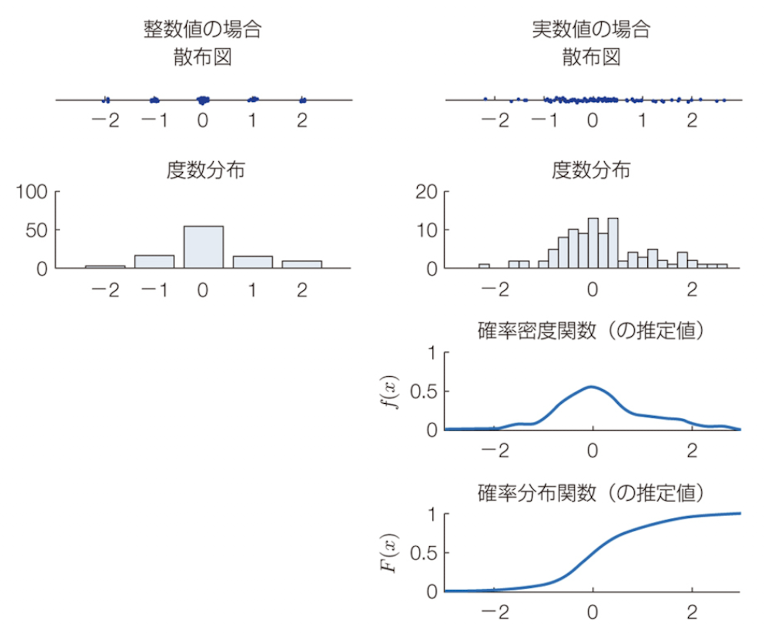
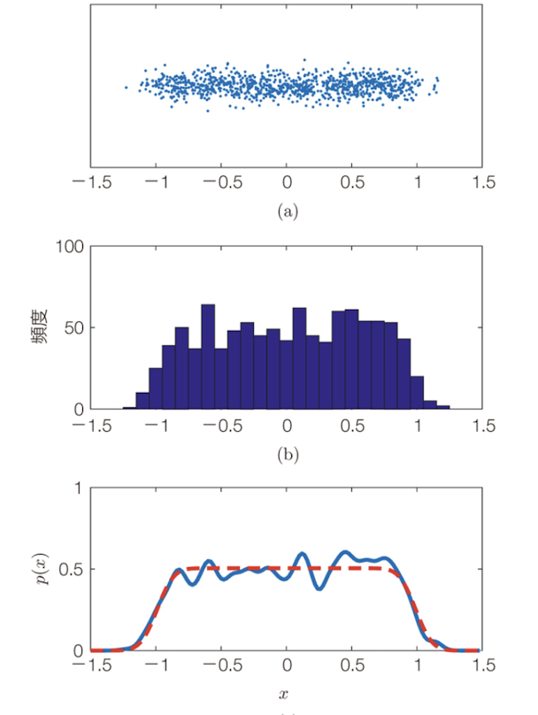
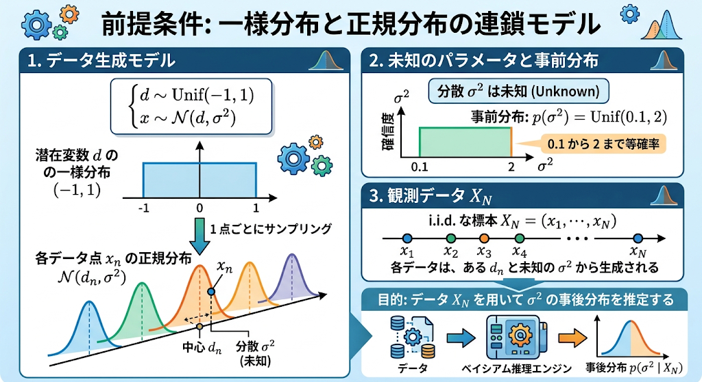
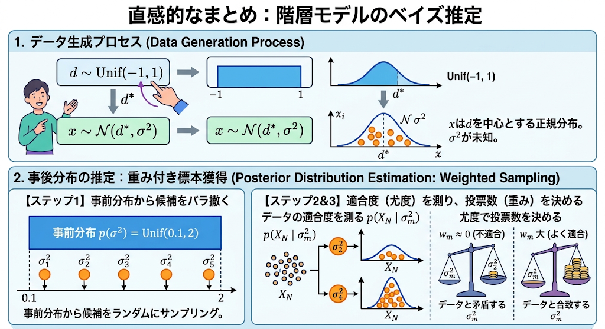

# Chapter 4 確率的生成モデルとガウス過程

「観測 $Y$ は確率分布 $p(Y)$ からのサンプリング $Y \sim p(Y)$ により得られた」とする仮説を、観測 $Y$ の確率的生成モデル（probabilistic generative model）と呼ぶ。
本章ではこのモデリングの考え方、定式化、計算方法を扱い、基礎固めを行う。

ガウス過程回帰の基本モデル $y = f(\mathbf{x}) + \epsilon$ では、入力を定数 $\mathbf{x}$ と固定した上で、関数 $f(\cdot)$、観測値 $y$、観測ノイズ $\epsilon$ を確率変数とみなす。
ここには直感と逆行する2つの大きな**発想の転換**がある。

* **尤度関数の導入**：「目の前にある観測値 $y$ は確率変数である」という転換（最尤推定法の基礎）。
* **事前確率・事後確率の導入**：「知りたい対象（隠れ変数 $\mathbf{f}$ や未知パラメータ $\theta$）は確率変数である」という転換（ベイズ推定の基礎）。

これらはガウス過程法のみならず機械学習全般の根底をなす重要な考え方である。

---

## 4.1 確率変数と確率的生成モデル

### 4.1.1 確率変数 $X$ と確率分布 $p(X)$

確率変数（random variable）とは、試行ごとに値が確率的に決まる変数である。

* **離散値の場合（例 1：サイコロの出目）**
とり得る値の集合を $\{1, \dots, 6\}$ とすると、各出目の確率の和は 1 となる。

$$\sum_{i=1}^6 p(X = i) = 1$$


* **連続値の場合（例 2：ダーツの刺さった位置）**
実現値 $x \in \mathbb{R}$ の出現確率は確率密度関数 $p(x)$ で表され、特定範囲に入る確率は積分 $p(a < x < b) = \int_a^b p(x) dx$ で定義される。全区間の積分は 1 となる。

$$\int_{-\infty}^\infty p(y) dy = \int p(y) dy = 1$$


1次元ガウス分布の確率密度関数は次式で与えられる。

$$\mathcal{N}(x \vert{} \mu, \sigma^2) = \frac{1}{\sqrt{2\pi\sigma^2}} \exp\left( - \frac{1}{2\sigma^2} (x - \mu)^2 \right)$$


> **定義 4.1（確率過程）**   
> 任意の $N$ 個の入力 $\mathbf{x}_1, \dots, \mathbf{x}_N \in \mathcal{X}$ に対し、$N$ 個の出力 $\mathbf{f}_N = (f(\mathbf{x}_1), \dots, f(\mathbf{x}_N))$ の同時確率 $p(\mathbf{f}_N)$ を与えられる関係 $f(\cdot)$ を **確率過程（stochastic process）** と呼ぶ。

- 「同時確率を与える」の具体例
たとえば入力として好きな地点を 2 つ（$x_1=1, \, x_2=3$）選ぶ。
このとき、それぞれの地点での高さ $(f_1, f_2) = (f(1), f(3))$ の組について、「$f_1$ が 1.5 付近、かつ $f_2$ が 3.2 付近になる確率はどれくらい？」という2つの値がペアでどう現れるかを表す数式（確率密度関数 $p(f_1, f_2)$）が 1 つにバシッと定まる、これが「同時確率を与える」ということ。
もしこれが $N=3$ 点なら $p(f_1, f_2, f_3)$ が定まり、$N=100$ 点なら 100 変数の同時確率 $p(f_1, \dots, f_{100})$ が定まる。


> **定義 4.2（ガウス過程）**  
> 確率過程 $f(\cdot)$ において、同時確率 $p(f_1, \dots, f_N)$ が $N$ 次元ガウス分布として得られる場合、$f(\cdot)$ を**ガウス過程**と呼ぶ。

「無限次元ベクトル」や「ヒルベルト空間」を持ち出さずとも、「任意の自然数 $N$ に対して同時確率 $p(f_1, \dots, f_N)$ が定まる」と有限の枠組みで言い換えることで、ガウス過程を実用的に扱える。

---

### 4.1.2 同時確率 $p(X, Y)$ と周辺化

複数の確率変数の組 $(X, Y) \in \mathcal{X} \times \mathcal{Y}$ の分布を**同時分布（joint distribution）** $p(X, Y)$ と呼ぶ。

> **定義 4.3（周辺化と周辺分布）**  
> 同時分布 $p(X, Y)$ から不要な変数を積分（または総和）によって消去し、$p(X)$ を得る操作を**周辺化（marginalization）**、得られた分布を **周辺分布（marginal distribution）** と呼ぶ。
> 
> $$p(X) = \int p(X, Y) dY \quad \left( \text{離散値の場合: } p(X) = \sum_{Y \in \mathcal{Y}} p(X, Y) \right)$$
> 
> 


参考： https://kesco.co.jp/%E7%A2%BA%E7%8E%87%E5%88%86%E5%B8%83/

> [!NOTE]
右図の3つめは、$P(X, Y = y_j)$（赤枠で囲まれた列の分布）。
右図の4つめは、それを周辺確率$P(X, Y = y_j)$で正規化した条件付確率分布。
$P(X\vert{}Y = y_j)=\frac{P(X, Y = y_j)}{P(Y = y_j)}$

> **定義 4.4（条件付き分布）**.  
> $X$ を既知・所与としたときの $Y$ の確率分布を**条件付き分布** $p(Y\vert{}X)$ と呼ぶ。
> 
> $$\int p(Y\vert{}X) dY = 1 $$
> 
> 
> 
> ※ 条件側 $X$ に関する積分 $\int p(Y\vert{}X) dX$ には制約がない点に注意。

> **定義 4.5（ベイズの定理）**.  
> 乗法定理 $p(X, Y) = p(Y\vert{}X)p(X) = p(X\vert{}Y)p(Y)$ より導かれる：
> 
> $$p(Y\vert{}X) = \frac{p(X\vert{}Y)p(Y)}{p(X)}$$
> 
> 

---
練習のために以下で二例やってみる

#### 連鎖的生成モデルの手順（例 3：サイコロ・ダーツモデル）
- 確率的生成モデリング  
観測される値の生成過程を確率分布で表す作業

サイコロの出目 $d \in \{1,\dots,6\}$ に応じて狙う位置 $\boldsymbol{\mu}(d)$ を決め、投げたダーツの刺さった位置 $x$ を観測するモデルを考える。


やりたいこと
- $x$の確率分布を密度関数$p(x)$の形で書き下す
- サイコロの出目 $d$ が分からなくても、ダーツの刺さった位置 $x$ だけを見て、それがどんな確率分布 $p(x)$ に従って現れるかを数式で導き出すこと

そのために
- 現実には「サイコロの目 $d$」という途中の隠れた要因（潜在変数）があるが、最終的に観測・評価したいのは「ダーツの刺さった位置 $x$」。
- この $x$ の分布を求めるために、サイコロの出目$d$ が決まったときの $x$ の確率（的ごとのブレ）を別々にモデル化して結合し、
最後に「出目 $d$ を足し合わせて消去（周辺化）する」ことで、目的の分布 $p(x)$（混合ガウス分布）を手に入れる。

やること

1. 未知の値を確率変数で表す : 
  こんかいは、$x$ と $d$
<br>

2. 個々の生成過程を確率分布で表す：
    - サイコロの出目の確率
    $$p(d=1) = 1/6,...,p(d=6) = 1/6 $$
    $$p(d) = 1/6 $$

    - ダーツが刺さる位置  
    $\mu$ を中心として適当な分散$\sigma^2$を持つと仮定
    $$\quad p(x\vert{}d) = p(x\vert{}\mu(d)) = \mathcal{N}(x \vert{} \boldsymbol{\mu}(d), \sigma^2)$$

    記号 $\sim$ を用いるとシンプルに表現できる：

    $$\begin{cases} d \sim p(d) \\ x\vert{}d \sim \mathcal{N}(\boldsymbol{\mu}(d), \sigma^2) \end{cases} $$
<br>

3. 同時分布を表す
$X, D$の同時分布$p(x,d)$は2のそれぞれの積になる
$$p(x, d) = p(x\vert{}d)p(d)$$
<br>

4. 不要な変数を周辺化して必要な分布を求める：
$p(x, d)$を$d$に関して周辺化することで$p(x)$を得る
$$p(x) = \sum_{d=1}^6 p(d)p(x\vert{}d) = \sum_{d=1}^6 \frac{1}{6} \mathcal{N}(x \vert{} \boldsymbol{\mu}(d), \sigma^2)$$

<br>

これは複数のガウス分布の重み付き平均であり、混合ガウス分布（mixture of Gaussian distribution）と呼ばれる。上図の下段の6つの山を持つ確率密度平均。


#### ガウス過程回帰モデルへの適用（例 4）

ガウス過程回帰モデル $y = f(x)+\epsilon$において入力点$X = (x_1, ..., X_N)^T$は所与の定数とする。
入力点 $\mathbf{X}$ を固定したとき、ガウス過程回帰も2段階の連鎖的モデルとなる。


$$\begin{cases} \mathbf{f} \sim \mathcal{N}(\boldsymbol{\mu}, \mathbf{K}) \\ \mathbf{y}\vert{}\mathbf{f} \sim \mathcal{N}(\mathbf{f}, \sigma^2 \mathbf{I}_N) \end{cases} $$


観測値 $\mathbf{y}$ の予測分布は、潜在関数値 $\mathbf{f}$ を周辺化積分して導出される：


$$p(\mathbf{y}) = \int p(\mathbf{y}\vert{}\mathbf{f}) p(\mathbf{f}) d\mathbf{f} = \mathcal{N}(\boldsymbol{\mu}, \sigma^2\mathbf{I}_N) $$

>（元の関数のブレ ＋ 観測のブレ）を足し算
>
---

### 4.1.3 独立性と条件付き独立性

> **定義 4.6（確率変数の独立性）**.  
> 次式が成り立つとき、$X$ と $Y$ は **独立（independent）** である  
（$p(X) = p(X\vert{}Y)$ と等価）
> $$p(X, Y) = p(X)p(Y)$$

> **定義 4.7（確率変数の条件付き独立性）**.  
> 次式を満たすとき、$X$ と $Y$ は **条件 $Z$ のもとで条件付き独立（conditionally independent）** である。
> $$p(X, Y \vert{} Z) = p(X\vert{}Z)p(Y\vert{}Z)$$

※ 条件付き独立であっても、無条件で独立 $p(X, Y) = p(X)p(Y)$ とは限らない点に注意。

#### 例5. 3つ以上の確率変数間の独立性や条件付き独立性  
$$p(A, B, C \vert{} D, E) = p(A \vert{} D, E) p(B, C \vert{} D, E)$$
が成り立つとき、条件 $(B, C)$ の組み合わせを $F$、条件 $(D, E)$ の組み合わせを $G$ と呼び直すことによって$$p(A, F \vert{} G) = p(A\vert{}G)p(F\vert{}G)$$が得られる。このとき条件 $(D, E)$ のもとで、$A$ と $(B, C)$ が条件付き独立であることがいえる。

#### 例6. 多変量ガウス分布における独立性
$y_1, y_2, y_3$ の同時確率 $p(y_1, y_2, y_3)$ が平均 $(\mu_1, \mu_2, \mu_3)$ と共分散行列 $\sigma^2 \mathbf{I}_3$ をもつ3次元ガウス分布であるとき、これらの3変数は互いに独立
(照明は省略)

#### 例7. ガウス過程回帰における性質 

ガウス過程回帰の連鎖的生成過程の2段目は 
$$p(\mathbf{y}\vert{}\mathbf{f}) = \mathcal{N}(\mathbf{f}, \sigma^2 \mathbf{I}_N)$$
となっていた（例4）。
これは $y_1, \dots, y_N$ の $N$ 個の確率変数が互いに「$\mathbf{f}$ を条件とした条件付き独立」であることを意味する。
すなわち、
$$p(\mathbf{y}\vert{}\mathbf{f}) = p(y_1\vert{}\mathbf{f}) \times \dots \times p(y_N\vert{}\mathbf{f})$$
が成り立つ。

しかし、$\mathbf{f}$ を周辺化消去した $p(\mathbf{y})$ では一般に $y_n$ 同士は無条件には独立ではない
$$p(\mathbf{y}) = \int p(\mathbf{y}\vert{}\mathbf{f}) p(\mathbf{f}) \, d\mathbf{f}$$
に対して、一般に、$p(\mathbf{y}) \neq p(y_1) \times \dots \times p(y_N)$ 

> [!WARNING]
> あとでちゃんと考える

#### 例8.独立同分布と条件付き独立性
同一分布から独立に標本を得ることを i.i.d.（independent and identically distributed）サンプリングと呼ぶ。
例えば、同じサイコロを三回振って、その出目を観測する過程を↓のように書く。
$$d_1, d_2, d_3 \stackrel{\text{i.i.d.}}{\sim} p(d)$$
現実には完全な i.i.d. は存在せず、理解を単純化するための仮定である。

---

### 4.1.4 ガウス過程回帰モデルのグラフィカルモデル

グラフィカルモデル（graphical model）は、変数間の独立性や依存関係を可視化する記法である。

* **○（円ノード）**：確率変数。
* **□（四角ノード）**：観測データ（確定した値）。
* **文字のみ（丸なし）**：定数・所与のパラメータ（入力 $\mathbf{X}$ など）。
* **矢印（有向リンク $\rightarrow$）**：条件付き確率 $p(X\vert{}Y)$（$Y \rightarrow X$）。
* **実線（無向リンク）**：相関があり、同時確率で表される関係。
* **プレート表示（外枠パネル）**：$n = 1, \dots, N$ 回の繰り返しサンプリングを簡潔に示す表現。


#### 例 9（線形回帰のグラフィカルモデル）
線形回帰の確率的生成モデルを、グラフィカルモデルで描いてみる

連鎖的生成過程.  
$$\begin{cases} w_m \stackrel{\text{i.i.d.}}{\sim} \mathcal{N}(0, \lambda^2) \\ f_n \vert{} \mathbf{x}_n = f(\mathbf{x}_n; \mathbf{w}) = \sum_{m=1}^M w_m \phi_m(\mathbf{x}_n) \\ y_n \vert{} f_n \sim \mathcal{N}(f_n, \sigma^2) \end{cases}$$

ここで $n = 1, \dots, N$ は観測のインデックス、$m = 1, \dots, M$ は基底のインデックス

潜在関数値 $f_1, \dots, f_N$ は共通パラメータ $\mathbf{w}$ を介して結ばれており、$f_n$ 同士を直接結ぶリンクは存在しない。


#### 例 10. ガウス過程回帰

3.3.3 節のノイズを含む確率的生成モデルは、以下のようにまとめて書くことができます。$$\begin{aligned}
\mathbf{f}_N, f_* | \mathbf{X}, \mathbf{x}_* &\sim \mathcal{N}(\boldsymbol{\mu}, \mathbf{K}) \\
y_n | f_n &\sim \mathcal{N}(f_n, \sigma^2) \\
y_* | f_* &\sim \mathcal{N}(f_*, \sigma^2)
\end{aligned}$$

ここで $\boldsymbol{\mu}$ と $\mathbf{K}$ は $N+1$ 個の入力点 $\mathbf{X}, \mathbf{x}_*$ に対応する平均と共分散行列。

同時確率が共分散行列 $\mathbf{K}$ で結ばれているため、**グラフィカルモデル上では $f_1, \dots, f_N, f_*$ の全ペアが無向リンクで結合される**点に特徴がある。


---

## 4.2 最尤推定とベイズ推定

### 4.2.1 確率的生成モデルと最尤推定

#### 4.2.1.1 確率的生成モデルの考え方
現実世界の観測 $Y$ は、何らかの確率分布 $p(Y)$ からのサンプリングによって得られたと仮定する。この過程を現実世界のデータ生成に見立てた仮説を、観測 $Y$ の**確率的生成モデル**（または単に確率モデル）と呼ぶ。

- **モデルは仮説である**:
  真実そのものである保証はない（George Box「すべてのモデルは間違っているが、いくつかのものは有用である」）。囲碁や将棋といった完全情報決定論的ゲームの勝敗データであっても、不確かな対象の解析のために確率モデルを適用することがある。
- **確率モデルを導入する理由**:
  目の前にある確定した観測データをあえて確率変数として扱うのは、データの背後にある構造の理解や将来予測に極めて有用だからである。
- **パラメトリックモデル**:
  同じ対象に対して複数の仮説が考えられる場合、仮説間の差異をパラメータ $\theta$ で表し、条件付き確率 $p(Y|\theta)$ として定式化する。これを**パラメトリックモデル**と呼ぶ。
  - 例：公平なサイコロなら $p(Y=i)=1/6$。出目に偏りがあるならパラメータ $\theta = (a_1, \ldots, a_6)$ を用いて $p(Y=i)=a_i$ と表す。

---

#### 4.2.1.2 最尤推定（Maximum Likelihood Estimation: MLE）
パラメトリックモデルにおいて、観測データ $Y$ をもとにパラメータ $\theta$ を決定する操作をパラメータの推定と呼ぶ。その基本手法が**最尤推定**である。

- **尤度関数 (Likelihood Function)**:
  観測データ $Y$ を定数として扱い、$\theta$ の関数と見立てたもの：
  $$L(\theta) = p(Y|\theta)$$
- **最尤推定量**:
  尤度関数 $L(\theta)$ を最大化するパラメータ $\theta$：
  $$\hat{\theta}_{\mathrm{ML}} = \arg\max_{\theta} L(\theta) $$
  （※ $\arg\max_{\theta} L(\theta)$ は最大値を与える引数・パラメータ値を表す）

> **最尤推定の発想**：
> 未知数を $x$ と置いて方程式を立てて解くアプローチと同じ。未知パラメータ $\theta$ が既知であるかのようにデータ生成過程を尤度関数 $L(\theta)$ としてモデル化し、得られた観測から逆算して $\theta$ を決定する。

---

<div style="background-color: #f6f9f9; padding: 10px;">

#### よりみち：最尤推定は何をしたいのか？

最尤推定（Maximum Likelihood Estimation; MLE）の目的は、

> 「観測されたデータを最も自然に説明できるパラメータを求める」

ことである。

言い換えると、

> 「もしパラメータ θ がこの値だったら、今観測したデータはどれくらい起こりやすいか？」

を考え、その確率が最大になる θ を選ぶ方法である。

---

##### サイコロの例

サイコロを10回振った結果が次だったとする。

```text
6, 6, 5, 6, 4, 6, 6, 5, 6, 6
```

###### 仮説1：公平なサイコロ

```math
P(6)=\frac{1}{6}
```

###### 仮説2：6が出やすいサイコロ

```math
P(6)=0.7
```

観測データでは 6 が 7 回出ているため、

```text
公平なサイコロよりも
6が出やすいサイコロの方が説明しやすそう
```

と感じられる。

最尤推定では、この「説明しやすさ」を数式化する。

---

##### 尤度（Likelihood）

観測データを Y、
パラメータを θ とすると、

```math
L(\theta)=p(Y|\theta)
```

を尤度（Likelihood）という。

これは

> 「パラメータ θ のもとで、観測データ Y が生成される確率」

を表している。

---

##### 最尤推定

最尤推定量は、

```math
\hat{\theta}_{ML}
=
\arg\max_{\theta} p(Y|\theta)
```

で定義される。

意味は

> 「観測データ Y が最も起こりやすくなる θ を選ぶ」

である。

---

##### まとめ

最尤推定とは、

① データ生成モデルを仮定する
      p(Y|θ)

② 実際のデータを観測する

③ そのデータが最も起こりやすくなる
   パラメータ θ を探す

④ その θ を採用する

という考え方である。

一言で表すと、

> 最尤推定とは「観測データを最も自然に説明できるパラメータを逆算する方法」である。

</div>

---
#### 4.2.1.3 最尤推定の具体例

##### 例11: 共分散既知のガウス分布の平均の最尤推定
観測された $N$ 個の $D$ 次元縦ベクトル $\mathbf{y}_n \in \mathbb{R}^D \ (n=1,\ldots,N)$ が、平均 $\boldsymbol{\mu}$、既知の共分散行列 $\boldsymbol{\Sigma}$ を持つガウス分布から独立に生成されたとする：
$$\mathbf{y}_n \sim \mathcal{N}(\boldsymbol{\mu}, \boldsymbol{\Sigma}) $$

尤度関数：
未知の平均ベクトル$\boldsymbol{\mu}$の関数として...
$$L(\boldsymbol{\mu}) = \prod_{n=1}^N \frac{1}{\sqrt{(2\pi)^D |\boldsymbol{\Sigma}|}} \exp\left( -\frac{1}{2}(\mathbf{y}_n - \boldsymbol{\mu})^T \boldsymbol{\Sigma}^{-1} (\mathbf{y}_n - \boldsymbol{\mu}) \right) $$

対数をとることで主要項がパラメータの2次式となり、計算が容易になる（**対数尤度**）：
$$\log L(\boldsymbol{\mu}) = -\frac{N}{2}\log((2\pi)^D |\boldsymbol{\Sigma}|) - \sum_{n=1}^N \frac{1}{2}(\mathbf{y}_n - \boldsymbol{\mu})^T \boldsymbol{\Sigma}^{-1} (\mathbf{y}_n - \boldsymbol{\mu}) $$

$\log L(\boldsymbol{\mu})$ は $\boldsymbol{\mu}$ に関して上に凸な2次関数なので、$\boldsymbol{\mu}$ で微分してゼロとおく（停留点を求める）ことで最尤推定量が得られる：
$$\hat{\boldsymbol{\mu}}_{\mathrm{ML}} = \frac{1}{N}\sum_{n=1}^N \mathbf{y}_n $$
（観測データの標本平均と一致する）

---

##### 例12: サイコロを用いたダーツ投げモデルの最尤推定
サイコロの出目 $d_n \in \{1,\ldots,6\}$ と、投げたダーツの水平座標 $X_n$ のデータが $N$ 回分あるとする：
$$\begin{cases} d_n \overset{\mathrm{i.i.d.}}{\sim} p(d) \\ X_n | d_n \overset{\mathrm{i.i.d.}}{\sim} \mathcal{N}(\mu(d_n), \sigma^2) \end{cases} $$
狙った位置座標 $\boldsymbol{\theta} = (\mu(1), \ldots, \mu(6))$ を未知パラメータとして推定する。公平なサイコロ（$p(d_n) = 1/6$）とし、各試行の確率密度は以下となる：
$$p(X_n | d_n, \boldsymbol{\theta}) = \frac{1}{\sqrt{2\pi\sigma^2}} \exp\left( -\frac{1}{2\sigma^2}(X_n - \mu(d_n))^2 \right) $$

尤度関数および対数尤度関数：
$$L(\boldsymbol{\theta}) = \prod_{n=1}^N p(d_n) p(X_n | d_n, \boldsymbol{\theta}) $$
$$\log L(\boldsymbol{\theta}) = \sum_{n=1}^N \left( \log(1/6) - \frac{1}{2}\log(2\pi\sigma^2) - \frac{1}{2\sigma^2}(X_n - \mu(d_n))^2 \right) $$

$\mu(1)$ に関する項を抜き出すため、$d_n = 1$ となったインデックスの集合を $N_1$、要素数を $n_1$、$d_n = 1$ のときの観測平均を $\overline{X_1}$ とする：
$$\log L(\boldsymbol{\theta}) = -\frac{1}{2\sigma^2} \sum_{n \in N_1} (X_n - \mu(1))^2 + \text{others} = -\frac{1}{2\sigma^2} \left( n_1 \overline{X_1^2} - 2n_1 \overline{X_1}\mu(1) + n_1 \mu(1)^2 \right) + \text{others} $$

これは $\mu(1)$ に関する単純な2次式であるため、最大化条件から直ちに最尤推定量が求まる：
$$\hat{\mu}(1) = \overline{X_1} = \frac{1}{n_1} \sum_{n \in N_1} X_n$$
他の $\mu(2), \ldots, \mu(6)$ についても同様に、各出目における標本平均となる。

---

> 260915 ここから!!
> 参考：https://stats.biopapyrus.jp/bayesian-statistics/bayesian-estimation.html

### 4.2.2 確率的生成モデルとベイズ推定

#### 4.2.2.1 ベイズ推定の基本思想
- **パラメータも確率変数として扱う**:
  最尤推定では未知パラメータ $\theta$ を「固定された1つの値」とみなすが、ベイズ推定では「**未知パラメータ $\theta$ 自体も確率変数である**」と考える。
- **推定の本質は分布の更新**:
  観測 $Y$ を得ることで、確率変数 $\theta$ の分布を更新する手続きをベイズ推定と呼ぶ。
  - **事前確率分布 $p(\theta)$** (prior): データを観測する前のパラメータに関する信念や取り得る範囲。
  - **事後確率分布 $p(\theta|Y)$** (posterior): 観測 $Y$ を踏まえて更新された後の分布。

---

#### 4.2.2.2 ベイズ推定の手順
ベイズ推定は以下の3ステップで進める：

1. **尤度関数のモデリング**:
   未知変数 $\theta$ のもとで観測 $Y$ が生成される過程を条件付き確率 $p(Y|\theta)$ として定式化し、$\theta$ の関数 $L(\theta) = p(Y|\theta)$ と見なす。
2. **事前確率のモデリング**:
   $\theta$ の取り得る値の範囲や主観的な確信度を確率分布 $p(\theta)$ として表現する。
3. **ベイズの定理の適用**:
   事後確率分布 $p(\theta|Y)$ を導出する：
   $$p(\theta | Y) = \frac{p(Y | \theta) p(\theta)}{p(Y)} $$

分母の $p(Y)$ は次式で定義される：
$$p(Y) = \int p(Y|\theta) p(\theta) d\theta$$
- 観測 $Y$ の実現値が所与のとき、$\theta$ に依存しない定数となる。
- 事後分布の積分を1にするための**正規化定数** (normalization constant)、あるいは事前確率で周辺化したという意味で**周辺尤度** (marginal likelihood) と呼ばれる。

---

#### 4.2.2.3 最尤推定とベイズ推定の比較
| 項目 | 最尤推定 (MLE) | ベイズ推定 |
| :--- | :--- | :--- |
| **パラメータ $\theta$ の扱い** | 未知の固定値（点推定） | 確率変数（分布として推定） |
| **事前知識の導入** | 原則反映しない | 事前分布 $p(\theta)$ として明示的に反映 |
| **出力結果** | 単一の推定値 $\hat{\theta}_{\mathrm{ML}}$ | 事後確率分布 $p(\theta\|Y)$ |
| **不確実性の評価** | 推定値単体では不確実性が分からない | 分布の広がり（分散・共分散）として自然に評価可能 |

> ガウス過程法では、未知関数の値に対して平均と共分散を持つガウス分布（事後分布）が得られるため、ベイズ推定の枠組みと極めて親和性が高い。

---

#### 例13: 共分散既知のガウス分布中心のベイズ推定

##### モデル設定
平均 $\boldsymbol{\mu}$、既知の共分散行列 $\boldsymbol{\Sigma}$ を持つガウス分布からの観測 $\mathbf{y}_n \in \mathbb{R}^D$ を考える。未知パラメータ $\boldsymbol{\mu}$ の事前分布もガウス分布に従うと仮定する：
$$\mathbf{y}_n \sim \mathcal{N}(\boldsymbol{\mu}, \boldsymbol{\Sigma}), \quad n=1,\ldots,N $$
$$\boldsymbol{\mu} \sim \mathcal{N}(\boldsymbol{\mu}_0, \boldsymbol{\Sigma}_{\mu 0}) $$
（$\boldsymbol{\mu}_0$ は事前分布の中心、$\boldsymbol{\Sigma}_{\mu 0}$ は事前分布の共分散行列）

##### 事後分布の導出
ベイズの定理を対数表現で表す：
$$\log p(\boldsymbol{\mu} | Y) = \log p(Y | \boldsymbol{\mu}) + \log p(\boldsymbol{\mu}) - \log p(Y) $$

第3項は $\boldsymbol{\mu}$ に依存しない定数項（$\mathrm{const.}$）であるため整理すると：
$$\begin{aligned}
\log p(\boldsymbol{\mu} | Y) &= -\frac{1}{2} \sum_{n=1}^N (\mathbf{y}_n - \boldsymbol{\mu})^T \boldsymbol{\Sigma}^{-1} (\mathbf{y}_n - \boldsymbol{\mu}) - \frac{N}{2}\log(2\pi)^D |\boldsymbol{\Sigma}| \\
&\quad - \frac{1}{2} (\boldsymbol{\mu} - \boldsymbol{\mu}_0)^T \boldsymbol{\Sigma}_{\mu 0}^{-1} (\boldsymbol{\mu} - \boldsymbol{\mu}_0) - \frac{1}{2}\log(2\pi)^D |\boldsymbol{\Sigma}_{\mu 0}| + \mathrm{const.} 
\end{aligned}$$

対数事後密度関数が $\boldsymbol{\mu}$ の2次形式であるため、事後分布も再びガウス分布 $\mathcal{N}(\bar{\boldsymbol{\mu}}, \boldsymbol{\Sigma}_\mu)$ となる：

$$\log p(\boldsymbol{\mu} | Y) = -\frac{1}{2} (\boldsymbol{\mu} - \bar{\boldsymbol{\mu}})^T \boldsymbol{\Sigma}_\mu^{-1} (\boldsymbol{\mu} - \bar{\boldsymbol{\mu}}) - \frac{1}{2}\log(2\pi)^D |\boldsymbol{\Sigma}_\mu| $$

係数を比較して平方完成することにより、事後分布の共分散行列 $\boldsymbol{\Sigma}_\mu$ と平均ベクトル $\bar{\boldsymbol{\mu}}$ が求まる：
$$\boldsymbol{\Sigma}_\mu = \left( N\boldsymbol{\Sigma}^{-1} + \boldsymbol{\Sigma}_{\mu 0}^{-1} \right)^{-1}$$
$$\bar{\boldsymbol{\mu}} = \left( N\boldsymbol{\Sigma}^{-1} + \boldsymbol{\Sigma}_{\mu 0}^{-1} \right)^{-1} \left( \boldsymbol{\Sigma}^{-1}\sum_{n=1}^N \mathbf{y}_n + \boldsymbol{\Sigma}_{\mu 0}^{-1}\boldsymbol{\mu}_0 \right) $$


---

<div style="background-color: #f6f9f9; padding: 10px;">

式変形を復習がてら一応追ってみた。

**前提の確率密度関数の定義**

データ $\mathbf{y}_n$ およびパラメータ $\boldsymbol{\mu}$ は $D$ 次元ベクトル

1. **尤度関数 $p(Y \vert{} \boldsymbol{\mu})$**
データ $Y = \{\mathbf{y}_1, \dots, \mathbf{y}_N\}$ が平均 $\boldsymbol{\mu}$、共分散行列 $\boldsymbol{\Sigma}$ の正規分布から独立同分布（i.i.d.）で得られたと仮定。
各サンプルの確率密度関数は以下の通り：

$$p(\mathbf{y}_n \vert{} \boldsymbol{\mu}) = \frac{1}{(2\pi)^{D/2} \vert{}\boldsymbol{\Sigma}\vert{}^{1/2}} \exp\left( -\frac{1}{2} (\mathbf{y}_n - \boldsymbol{\mu})^T \boldsymbol{\Sigma}^{-1} (\mathbf{y}_n - \boldsymbol{\mu}) \right)$$

独立性より、全体の尤度は各サンプルの積になる：

$$p(Y \vert{} \boldsymbol{\mu}) = \prod_{n=1}^N p(\mathbf{y}_n \vert{} \boldsymbol{\mu}) = \prod_{n=1}^N \left[ \frac{1}{(2\pi)^{D/2} \vert{}\boldsymbol{\Sigma}\vert{}^{1/2}} \exp\left( -\frac{1}{2} (\mathbf{y}_n - \boldsymbol{\mu})^T \boldsymbol{\Sigma}^{-1} (\mathbf{y}_n - \boldsymbol{\mu}) \right) \right]$$

2. **事前分布 $p(\boldsymbol{\mu})$**
平均 $\boldsymbol{\mu}_0$、共分散行列 $\boldsymbol{\Sigma}_{\mu 0}$ の正規分布とする：

$$p(\boldsymbol{\mu}) = \frac{1}{(2\pi)^{D/2} \vert{}\boldsymbol{\Sigma}_{\mu 0}\vert{}^{1/2}} \exp\left( -\frac{1}{2} (\boldsymbol{\mu} - \boldsymbol{\mu}_0)^T \boldsymbol{\Sigma}_{\mu 0}^{-1} (\boldsymbol{\mu} - \boldsymbol{\mu}_0) \right)$$

---

**ステップ 1：尤度 $p(Y \vert{} \boldsymbol{\mu})$ の対数を取る**


$$\begin{aligned} \log p(Y \vert{} \boldsymbol{\mu}) &= \sum_{n=1}^N \log \left[ \frac{1}{(2\pi)^{D/2} \vert{}\boldsymbol{\Sigma}\vert{}^{1/2}} \exp\left( -\frac{1}{2} (\mathbf{y}_n - \boldsymbol{\mu})^T \boldsymbol{\Sigma}^{-1} (\mathbf{y}_n - \boldsymbol{\mu}) \right) \right] \\ &= \sum_{n=1}^N \left( \log(1) - \log\left( (2\pi)^{D/2} \vert{}\boldsymbol{\Sigma}\vert{}^{1/2} \right) + \log\left( \exp\left( -\frac{1}{2} (\mathbf{y}_n - \boldsymbol{\mu})^T \boldsymbol{\Sigma}^{-1} (\mathbf{y}_n - \boldsymbol{\mu}) \right) \right) \right) \\ &= \sum_{n=1}^N \left( -\frac{1}{2} \log\left( (2\pi)^D \vert{}\boldsymbol{\Sigma}\vert{} \right) - \frac{1}{2} (\mathbf{y}_n - \boldsymbol{\mu})^T \boldsymbol{\Sigma}^{-1} (\mathbf{y}_n - \boldsymbol{\mu}) \right) \end{aligned}$$

第1項は $n$ に依存しないため、$N$ 回足し合わされて $N$ 倍になります：

$$\log p(Y \vert{} \boldsymbol{\mu}) = -\frac{1}{2} \sum_{n=1}^N (\mathbf{y}_n - \boldsymbol{\mu})^T \boldsymbol{\Sigma}^{-1} (\mathbf{y}_n - \boldsymbol{\mu}) - \frac{N}{2} \log\left( (2\pi)^D \vert{}\boldsymbol{\Sigma}\vert{} \right)$$

---

**ステップ 2：事前分布 $p(\boldsymbol{\mu})$ の対数を取る**

$$\begin{aligned} \log p(\boldsymbol{\mu}) &= \log \left[ \frac{1}{(2\pi)^{D/2} \vert{}\boldsymbol{\Sigma}_{\mu 0}\vert{}^{1/2}} \exp\left( -\frac{1}{2} (\boldsymbol{\mu} - \boldsymbol{\mu}_0)^T \boldsymbol{\Sigma}_{\mu 0}^{-1} (\boldsymbol{\mu} - \boldsymbol{\mu}_0) \right) \right] \\ &= -\log\left( (2\pi)^{D/2} \vert{}\boldsymbol{\Sigma}_{\mu 0}\vert{}^{1/2} \right) - \frac{1}{2} (\boldsymbol{\mu} - \boldsymbol{\mu}_0)^T \boldsymbol{\Sigma}_{\mu 0}^{-1} (\boldsymbol{\mu} - \boldsymbol{\mu}_0) \\ &= -\frac{1}{2} (\boldsymbol{\mu} - \boldsymbol{\mu}_0)^T \boldsymbol{\Sigma}_{\mu 0}^{-1} (\boldsymbol{\mu} - \boldsymbol{\mu}_0) - \frac{1}{2} \log\left( (2\pi)^D \vert{}\boldsymbol{\Sigma}_{\mu 0}\vert{} \right) \end{aligned}$$

---

**ステップ 3：ベイズの定理へ代入する**

$$\log p(\boldsymbol{\mu} \vert{} Y) = \log p(Y \vert{} \boldsymbol{\mu}) + \log p(\boldsymbol{\mu}) - \log p(Y)$$

分母の $-\log p(Y)$ はパラメータ $\boldsymbol{\mu}$ を含まないため、$\boldsymbol{\mu}$ に関しては定数：

$$-\log p(Y) = \mathrm{const.}$$

これにステップ1とステップ2の結果をそのまま代入：

$$\begin{aligned} \log p(\boldsymbol{\mu} \vert{} Y) &= \underbrace{\left[ -\frac{1}{2} \sum_{n=1}^N (\mathbf{y}_n - \boldsymbol{\mu})^T \boldsymbol{\Sigma}^{-1} (\mathbf{y}_n - \boldsymbol{\mu}) - \frac{N}{2}\log(2\pi)^D \vert{}\boldsymbol{\Sigma}\vert{} \right]}_{\log p(Y \vert{} \boldsymbol{\mu})} \\ &\quad + \underbrace{\left[ -\frac{1}{2} (\boldsymbol{\mu} - \boldsymbol{\mu}_0)^T \boldsymbol{\Sigma}_{\mu 0}^{-1} (\boldsymbol{\mu} - \boldsymbol{\mu}_0) - \frac{1}{2}\log(2\pi)^D \vert{}\boldsymbol{\Sigma}_{\mu 0}\vert{} \right]}_{\log p(\boldsymbol{\mu})} \\ &\quad + \underbrace{\vphantom{\frac{1}{2}} \mathrm{const.}}_{-\log p(Y)} \end{aligned}$$

括弧を外して整理：

$$\begin{aligned} \log p(\boldsymbol{\mu} \vert{} Y) &= -\frac{1}{2} \sum_{n=1}^N (\mathbf{y}_n - \boldsymbol{\mu})^T \boldsymbol{\Sigma}^{-1} (\mathbf{y}_n - \boldsymbol{\mu}) - \frac{N}{2}\log(2\pi)^D \vert{}\boldsymbol{\Sigma}\vert{} \\ &\quad - \frac{1}{2} (\boldsymbol{\mu} - \boldsymbol{\mu}_0)^T \boldsymbol{\Sigma}_{\mu 0}^{-1} (\boldsymbol{\mu} - \boldsymbol{\mu}_0) - \frac{1}{2}\log(2\pi)^D \vert{}\boldsymbol{\Sigma}_{\mu 0}\vert{} + \mathrm{const.} \end{aligned}$$

</div>
---

#### 4.2.2.4 精度行列（Precision Matrix）による直観的理解
分散の逆数を**精度**、共分散行列の逆行列を**精度行列**と呼ぶ：
$$\mathbf{S}_n = \boldsymbol{\Sigma}_n^{-1}, \quad \mathbf{S}_{\mu 0} = \boldsymbol{\Sigma}_{\mu 0}^{-1}, \quad \mathbf{S}_\mu = \boldsymbol{\Sigma}_\mu^{-1}$$

精度行列を用いて表すと、ベイズ更新の構造が直観的に把握しやすくなる：

##### 1. 精度の加法性
$$\mathbf{S}_\mu = \sum_{n=1}^N \mathbf{S}_n + \mathbf{S}_{\mu 0} $$
- 事後精度は「各観測の精度」と「事前の精度」の単純和となる。
- 観測が増えるほど精度情報が加算され、事後分散は小さくなる（確信度が高まる）。
- 事前確率 $\boldsymbol{\mu} \sim \mathcal{N}(\boldsymbol{\mu}_0, \mathbf{S}_{\mu 0}^{-1})$ の影響は、「精度 $\mathbf{S}_{\mu 0}$ を持つ仮想的な観測 $\mathbf{y}_0 = \boldsymbol{\mu}_0$ を得たこと」と等価である。

##### 2. 事後平均は精度による重みつき平均
$$\bar{\boldsymbol{\mu}} = \mathbf{S}_\mu^{-1} \left( \sum_{n=1}^N \mathbf{S}_n \mathbf{y}_n + \mathbf{S}_{\mu 0} \boldsymbol{\mu}_0 \right) $$
- 各観測値および事前平均を、それぞれの持つ精度（確からしさ）で重み付けした平均値となる。

##### 3. 逐次更新（Sequential Update）としての解釈
全 $N$ 個の観測を、最初の5個と残りの $N-5$ 個に分割して考える：

$$\mathbf{S}_\mu = \sum_{n=6}^N \mathbf{S}_n + \left( \sum_{n=1}^5 \mathbf{S}_n + \mathbf{S}_{\mu 0} \right) = \sum_{n=6}^N \mathbf{S}_n + \mathbf{S}_{\mu 5} $$

$$\bar{\boldsymbol{\mu}} = \mathbf{S}_\mu^{-1} \left( \sum_{n=6}^N \mathbf{S}_n \mathbf{y}_n + \sum_{n=1}^5 \mathbf{S}_n \mathbf{y}_n + \mathbf{S}_{\mu 0} \boldsymbol{\mu}_0 \right) = \mathbf{S}_\mu^{-1} \left( \sum_{n=6}^N \mathbf{S}_n \mathbf{y}_n + \mathbf{S}_{\mu 5} \boldsymbol{\mu}_5 \right)$$

ここで、
$$\mathbf{S}_{\mu 5} = \sum_{n=1}^5 \mathbf{S}_n + \mathbf{S}_{\mu 0}, \quad \boldsymbol{\mu}_5 = \mathbf{S}_{\mu 5}^{-1} \left( \sum_{n=1}^5 \mathbf{S}_n \mathbf{y}_n + \mathbf{S}_{\mu 0}\boldsymbol{\mu}_0 \right) $$
- **意味**: 「最初の5個の観測で得られた事後分布 $\mathcal{N}(\boldsymbol{\mu}_5, \mathbf{S}_{\mu 5}^{-1})$」を新たな事前分布とし、残り $N-5$ 個の観測で更新することと捉えられる。
- ベイズ推定では、データを一括処理しても、逐次的に1つずつ取り込んで更新しても同一の結果が得られる。


---

## 4.3 確率分布の表現

ベイズ推定の主目的は未知の値の事後確率分布を求めることにある。しかし、計算機上で確率分布を数値として表現・計算するには具体的な工夫が必要となる。


---

### 4.3.1 ノンパラメトリックモデルとは

確率変数の確率分布を数値表現する方法は、大きく**パラメトリック**と**ノンパラメトリック**の2種に大別される。

#### パラメトリック手法

* **定義**: 推定対象の分布が「一定次元のパラメータ」で規定されると仮定し、そのパラメータを求めることで分布を決定する手法。
* **代表例**: ガウス分布、ベータ分布など。
* 事前確率・尤度・事後確率をパラメトリック分布で表すアプローチを**パラメトリック確率的モデリング**と呼ぶ。

#### ノンパラメトリック手法

* **定義**: 既知の特定のパラメトリック分布を仮定せず、データから直接柔軟に分布を捉える手法。
* **代表例**: ヒストグラム法、カーネル密度推定法、K近傍法など。
* **ガウス過程の位置づけ**:
* 推定対象である未知関数 $f(x)$ に対して特定のパラメトリックな密度関数を仮定しないため、ノンパラメトリック手法の一種に分類される。
* ※ただし、任意の $N$ 点における出力 $(f(x_1), \dots, f(x_N))$ の同時分布はガウス分布に従うと仮定するため、パラメトリックな側面も併せ持つ。パラメトリック／ノンパラメトリックの区別は便宜的・歴史的な分類にすぎない。


---

### 4.3.2 確率分布を標本で表現する

#### 確率分布の可視化と標本表現

* $x$ がスカラーの場合、密度関数 $p(x)$ や分布関数 $F(x) = \int_{-\infty}^x p(t)dt$ を描くのが直接的である。
* 一方、分布から生成した標本 $x_1, \dots, x_N$ を散布図や度数分布として可視化する間接的表現も極めて有効である。
* 密度関数 $p(x)$ が解析的な形（閉形式）で書けない、あるいは極めて複雑な場合でも、**標本を生成できるならば確率分布の性質を十分に把握・近似できる**。



解析的な形で書けなくても、有限個の標本から確率分布を可視化することができれば、確率密度関数の形がなんとなく理解できる。


##### 例14：解析的に表せない分布の可視化

一様分布と正規分布を連鎖させたモデル：

$$\begin{cases} d \sim \text{Unif}(-1, 1) \\ x \sim \mathcal{N}(d, \sigma^2) \end{cases}$$


> $d$: 範囲$(-1, 1)$から問う確率で生成される
> $x$: $d$を中心とした正規分布


この周辺分布 $p(x)$ は単純な初等関数で解析的に表せないが、上記の手順に沿って標本 $x_1, \dots, x_N$（例: 1000点）を生成することで、ヒストグラムや散布図として容易に可視化・把握できる。



---

##### 標本による統計量の近似（モンテカルロ積分）

標本列 $x_1, \dots, x_N$ を用いると、期待値 $\mathbb{E}[f(x)] = \int f(x)p(x)dx$ や分散 $\mathbb{V}[f(x)]$ を単純平均で近似できる。

$$\mathbb{E}[f(x)] \approx \frac{1}{N} \sum_{n=1}^N f(x_n)$$

$$\mathbb{V}[f(x)] \approx \frac{1}{N} \sum_{n=1}^N (f(x_n) - \mathbb{E}[f(x)])^2$$

>コメント：それはそう

---

##### 重みつき標本（Weighted Samples）

分布を標本そのものの疎密だけでなく、各標本に重みを与えた組 $(w_n, x_n)$（$\sum_{n=1}^N w_n = 1$）で表現する手法。

重みつき標本のもとでの統計量は、重みつき平均で計算される：

$$\mathbb{E}[f(x)] \approx \sum_{n=1}^N w_n f(x_n)$$

$$\mathbb{V}[f(x)] \approx \sum_{n=1}^N w_n (f(x_n) - \mathbb{E}[f(x)])^2$$

##### 重点サンプリング（Importance Sampling）

「$p(x)$ の値は評価できるが、直接サンプリングすることが困難」な場合、サンプリングが容易な提案分布 $p_S(x)$ を用いて重みつき標本を得る。


[アルゴリズム: 重みつきサンプリング]
1: 各 n = 1, ..., N について:
     $x_n \sim p_S(x)$ により標本を取得
2: 重みを計算: $w_n = p(x_n) / p_S(x_n)$
3: 重みを正規化: $\sum_{k=1}^N w_k = 1$


---

##### 例15：解析的な形で書き表せない事後分布のベイズ推定

例14に対して、パラメータ $\sigma^2$ が未知で、
事前分布 $p(\sigma^2) = \text{Unif}(0.1, 2)$、
i.i.d. な標本 $X_N = (x_1, \dots, x_N)$ が与えられた状況を考える。

ベイズの定理より事後分布は以下となる：

$$p(\sigma^2 \vert{} X_N) = \frac{p(\sigma^2)p(X_N\vert{}\sigma^2)}{p(X_N)}$$

* **尤度**: $p(X_N \vert{} \sigma^2) = \prod_{n=1}^N p(x_n \vert{} \sigma^2)$
* **エビデンス（周辺尤度）**: $p(X_N) = \int \prod_{n=1}^N p(x_n \vert{} \sigma^2) p(\sigma^2) d\sigma^2$

尤度 $p(X_N \vert{} \sigma_m^2)$ が直接計算できる場合、事前分布からサンプリングした標本に尤度の重みを掛けることで事後分布の重みつき標本を得る。

> **[事後分布の重みつき標本獲得アルゴリズム]**
1: 各 m = 1, ..., M について:
     $σ_m^2 \sim p(σ^2)$ により事前分布から標本を取得
2: 重みを尤度で設定: $w_m = p(X_N | σ_m^2)$
3: 重みを正規化: $\sum_{m=1}^N w_m = 1$


隠れ変数 $d$ が含まれ尤度を直接計算できない場合は、隠れ変数も事前分布から多重サンプリング（$N'$ 点）して尤度をモンテカルロ近似する。

> **モンテカルロ法とMCMC**:
> ベイズ推定の結果を標本や重みつき標本として表現・取得する一連の手法を**モンテカルロ法**と呼ぶ。特に効率的な標本系列を構成する **マルコフ連鎖モンテカルロ法（MCMC法）** は、解析的に解けない事後分布を解く標準的アプローチである。

---

##### 例16：カーネル密度推定（KDE）

ノンパラメトリックな密度推定の代表例。$B$ 個の標本 $x_1, \dots, x_B$ を用い、基底関数の重ね合わせとして密度関数を推定する。

$$\tilde{p}(x) = \frac{1}{B} \sum_{b=1}^B h_b(x), \quad h_b(x) = h\left(\frac{x_b - x}{\sigma}\right)$$

* $h(x)$: 原点にピークを持つ**カーネル関数**（$\int h(x)dx = 1$, $h(x) \ge 0$）
* $\sigma$: 基底の広がりを制御する**バンド幅**

###### 代表的なカーネル関数

1. **ガウス分布カーネル**:
$$h(x) = \mathcal{N}(x \mid 0, \mathbf{I}_d)$$
滑らかで見栄えのよい推定量が得られる。
<br>

2. **エパネクニコフカーネル（Epanechnikov kernel）**:
$$h(x) = \frac{3}{4}(1 - \|x\|^2) \,\mathbb{I}(\|x\| < 1)$$
推定精度の理論的最適性に優れる。


>参考 : KDE
https://debimate.jp/ml/math/kde/

---

##### 例17：ニューラルネットワークを用いた分布表現

深層生成モデルでは、単純な潜在変数 $x \sim \mathcal{N}(\mathbf{0}, \mathbf{I}_D)$ をニューラルネットワーク $f(x; \mathbf{w})$ で変換し、高次元データ $y = f(x; \mathbf{w})$（画像や音声）の複雑な分布を表現する。

* CNNと逆畳み込み（Transposed Conv）を組み合わせた構造や、敵対的生成ネットワーク（GAN）などが代表的である。


---

##### 例15を直感的に理解する

**前提**
一様分布と正規分布を連鎖させたモデル：

$$\begin{cases} d \sim \text{Unif}(-1, 1) \\ x \sim \mathcal{N}(d, \sigma^2) \end{cases}$$
> $d$: 範囲$(-1, 1)$から一定の確率で生成される
> $x$: $d$を中心とした正規分布

・$\sigma^2$ が未知、
・事前分布 $p(\sigma^2) = \text{Unif}(0.1, 2)$、
・i.i.d. な標本 $X_N = (x_1, \dots, x_N)$ 




**全体として何をしたいのか**
- 手元の観測データ $X_N = (x_1, \dots, x_N)$ から、未知のノイズパラメータ $\sigma^2$ の事後分布 $p(\sigma^2 \mid X_N)$ を近似的に求めることが最終目的。
- 事後分布を数式（解析的）に直接解くことが難しいため、「重点サンプリング」を使って「値と重みのペア $\{(\sigma_m^2, w_m)\}$」という離散的な標本集合として表現する。
- これによって、未知だった $\sigma^2$ の平均値や確信区間などをデータから推定できる。


**直感的なまとめ**
- **候補をバラ撒く**: 事前分布 $\text{Unif}(0.1, 2)$ に従って、$\sigma^2$ の候補値 $\sigma_1^2, \dots, \sigma_M^2$ をランダムに選ぶ。
* **データの適合度を測る**: 各候補値 $\sigma_m^2$ に対して、「観測データ $X_N$ が現れる確率（尤度）」を計算する（$d$ は積分して消去）。
* **尤度で投票数を決める**: データと矛盾する $\sigma_m^2$ は重み $w_m \approx 0$ となり、データとよく合致する $\sigma_m^2$ は大きな重みを持つ。

これにより、事後分布の解析的な形が複雑であっても、ペア $\{(\sigma_m^2, \tilde{w}_m)\}_{m=1}^M$ を用いて事後平均や事後分散を容易に計算できるようになる。


